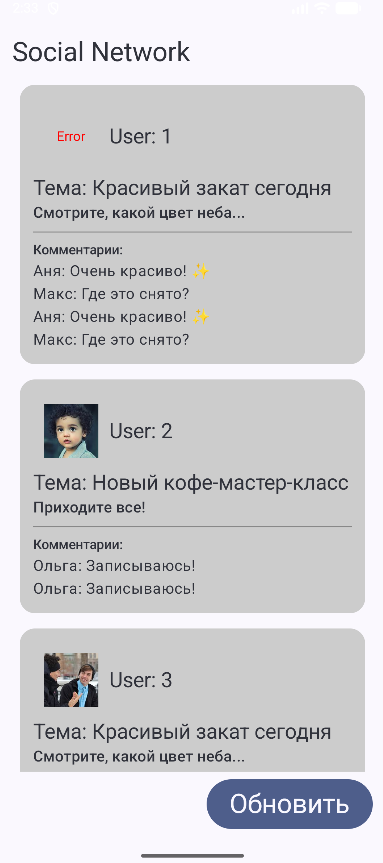

# Social Network App

Учебный проект — Android-приложение для отображения постов с параллельной загрузкой аватарок и комментариев.

## Скриншот

## Реализовано

- Загрузка постов из JSON (8–15 штук)
- Параллельная загрузка аватарки и комментариев для каждого поста
- Состояния загрузки (Loading / Ready / Error)
- Кнопка обновления с отменой всех текущих загрузок
- Имитация сетевых задержек (delay)
- Обработка ошибок через `runCatching` и кастомные исключения

## Технологии

- Kotlin + Coroutines
- Jetpack Compose
- Clean Architecture
- Kotlinx.Serialization (JSON)
- Coil (аватарки)

## Примечание

Проект представлен без Gradle-файлов — только исходный код для ознакомления с архитектурой.
